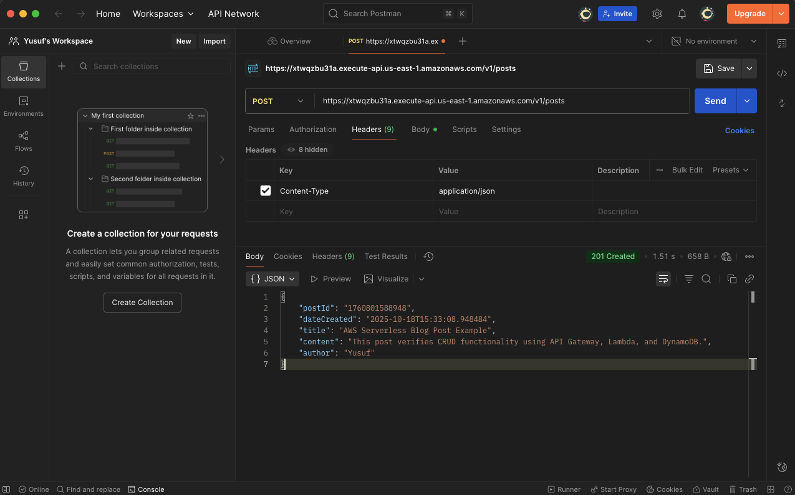
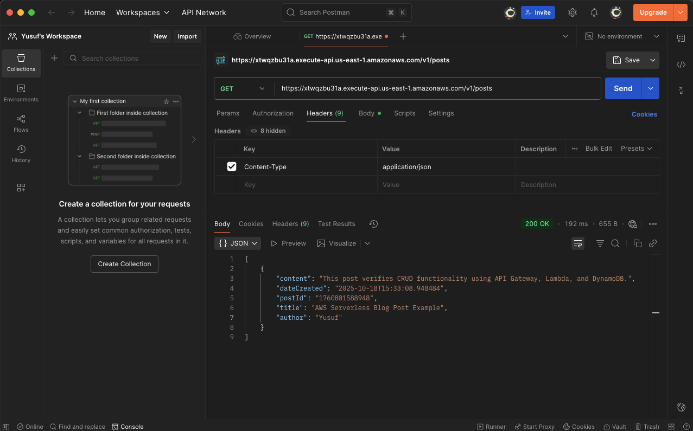
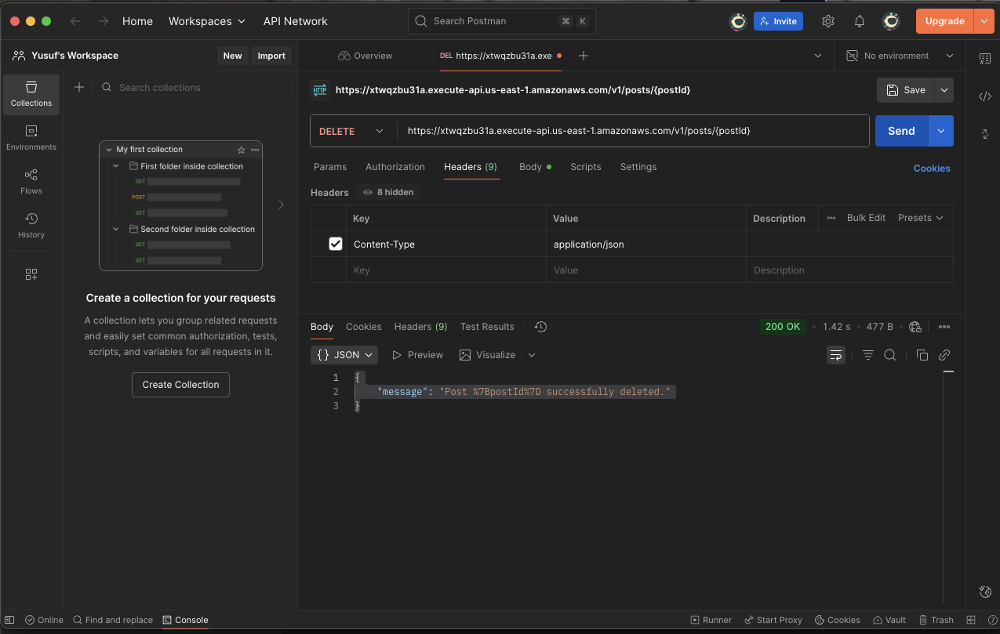

## Serverless Blog Platform (Python+DynamoDB+API Gateway)

This project delivers a robust, scalable, and fully serverless backend infrastructure for a simple blog platform or Content Management System (CMS). It enables full CRUD (Create, Read, Update, Delete) capabilities via a publicly accessible REST API.

## Architecture and Data Flow

The project showcases a highly reliable architecture built on the classic API-Lambda-Database pattern, utilizing Python (Boto3) for superior stability.

Architecture Diagram:

## Project Success Metrics (Testing Proof)

The core functionality was verified via Postman after successfully resolving critical integration failures.

## Key Technical Decisions & Challenges

This project was defined by overcoming persistent SDK and integration errors, which required a significant pivot in the technology stack:

    Critical Runtime Migration (Node.js → Python):

        Challenge: The initial Node.js Lambda suffered from fatal Runtime.ImportModuleError due to incompatible AWS SDK v2 usage with newer Node.js runtimes.

        Solution: Switched the runtime to Python 3.12+. This enabled the stable use of Boto3, which reliably handles DynamoDB interactions, resolving all SDK/Runtime conflicts and the subsequent 502 Bad Gateway errors.

    DynamoDB Schema Simplification:

        Challenge: Encountered a ValidationException (Key element does not match schema) during the DELETE operation. This was caused by attempting to delete an item without providing the unnecessary Sort Key (dateCreated).

        Solution: Rebuilt the BlogPosts table with only the Partition Key (postId). This ensured the DELETE logic remained simple and robust, adhering to efficient NoSQL practices.

    Error Handling Chain: Successfully diagnosed the final 500 Internal Server Error by tracing the failure from the API Gateway back to the Lambda's Runtime failure via CloudWatch Logs.

